# PFAS-Map
- [Installation](#Installation)
- [How to Use PFAS-Map](#How-to-Use-PFAS-Map)
  * [Exploring the classification of PFASs](#Exploring-the-classification-of-PFASs)
  * [Classify an unknown (potential) PFAS](#Classify-an-unknown-PFAS)
  * [Show your own PFAS dataset including classification and property](#Show-your-own-PFAS-dataset-including-classification-and-property)
  
## Installation

1. Do not worry about operating systems as PFAS-Map has been tested on macOS Catalina, Linux (Ubuntu LTS 20.04), and Windows 10.

2. Install Anaconda for Python 3.7 if your computer do not have Anaconda for Python 3. https://www.anaconda.com/products/individual

2. Install JRE 8 if your computer do not have Java Runtime Environment. If you are not sure, skip this step and come back later if error occurs. https://www.oracle.com/java/technologies/javase-jre8-downloads.html

3. Open Terminal (or "cmd" for Windows), input:
	```console
	conda create -c rdkit -n pfasmap rdkit python=3.7
	```
   This will setup a conda virtual environment "pfasmap" that you will use to run PFAS-Map

4. When the pfasmap environment is properly setup, input:
	```console
	conda activate pfasmap
	```
5. Now you are in the pfasmap virtual environment. Let's install the basic machine learning and visualization libraries:
	```console
	conda install numpy pandas scikit-learn plotly xlrd
	```
6. Two extra packages need to be installed using pip:
	```console
	pip install padelpy streamlit
	```
7. Then navigate to the path where you save the "PFAS-Map" package. For example, if you save the "PFAS-Map" package under "Documents/GitHub", input:
	```console
	cd Documents/GitHub/PFAS-Map
	```
8. Input the command below to start the PFAS-Map user interface:
	```console
	streamlit run user_interface.py
	```
9. Start exploring PFAS-Map! If there is any problem in the installation, please contact ansuzjut@outlook.com. If you want to skip the installation, you can still explore function 1 and 3 of PFAS-Map through the interactive graphs we provide in figshare files.


## How to Use PFAS-Map
### Exploring the classification of PFASs
1. Select the first function from the side bar

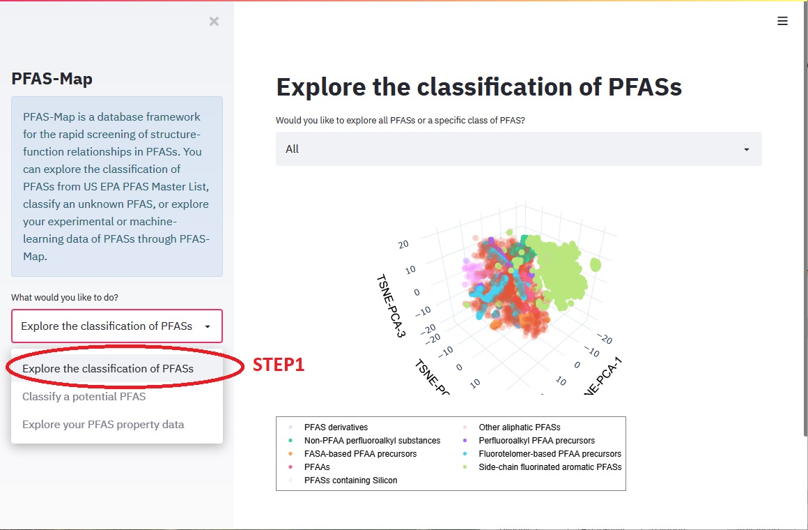


2. Select "all classes" if you want to see the classification from the main class level; Select "a specific class" if you want to see the subclass of PFASs under a specific class.

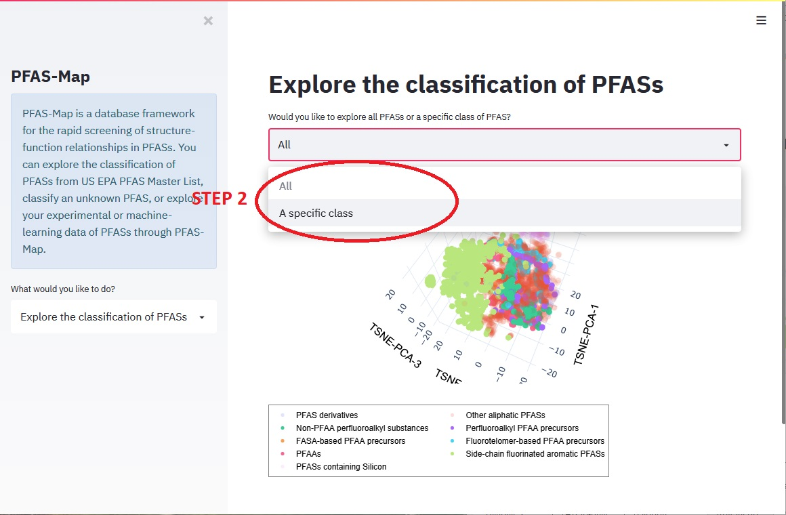

If you selected "a specific class", you will need to select one of the classes you are interested in.

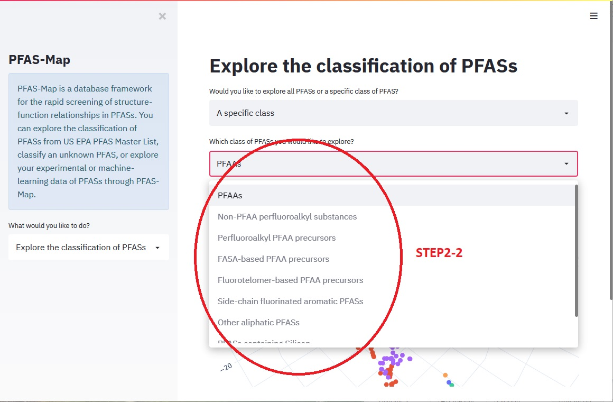


3. Hover the mouse cursor to the top right of the graph, click "full screen enter".

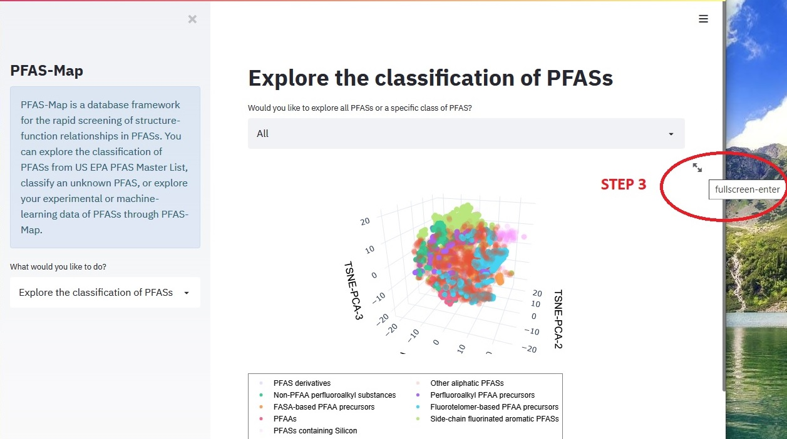


4. Start exploring the PFASs! 
   * Feel free to rotate the graph to find the perspective you like.
   * Hover the mouse cursor on any data point to see the value of components, SMILES, and class/subclass name.
   * Single-click the class/subclass legend to mute the class/subclass. Click the legend again to bring it back.
   * Double-click the class/subclass legend to only see this class/subclass.
   
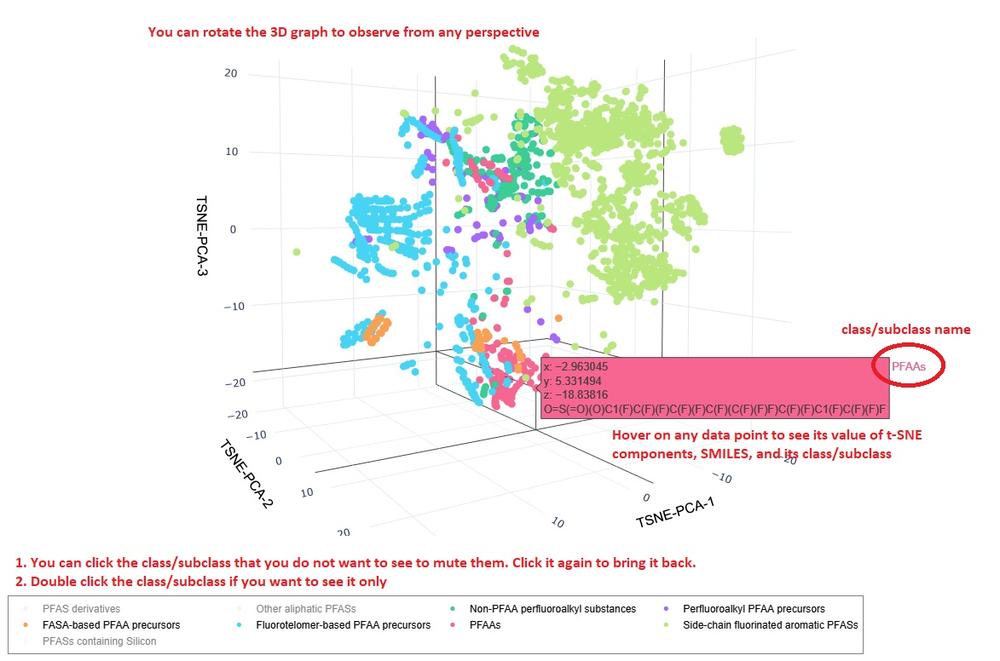


### Classify an unknown PFAS
1. * Select the second function "classify a potential PFAS" from the side bar, 
   * Then input the SMILES of the PFAS to the box, and press "enter".
   
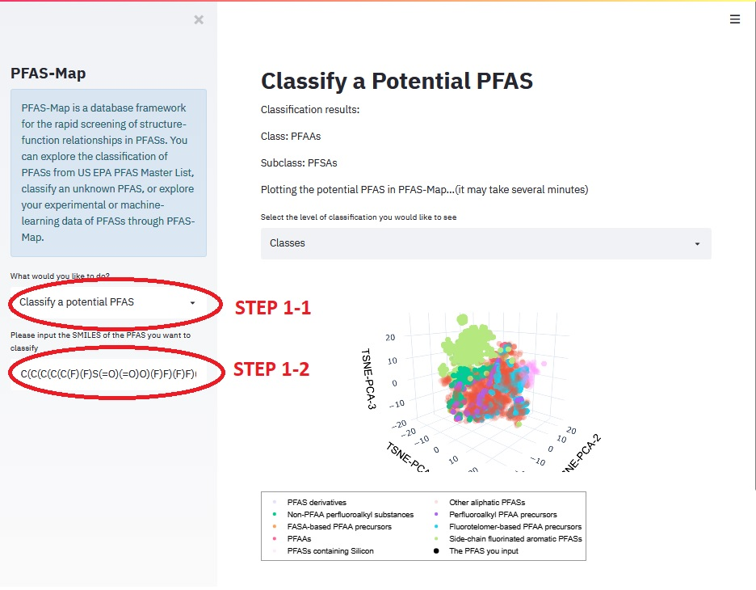


2. * Wait for a few seconds and the classification results will show up.
   * Select to see the PFAS you input from "classes"---the view of all classes or 
     "subclasses"---in the class the PFAS belongs to along with all other subclasses.
     
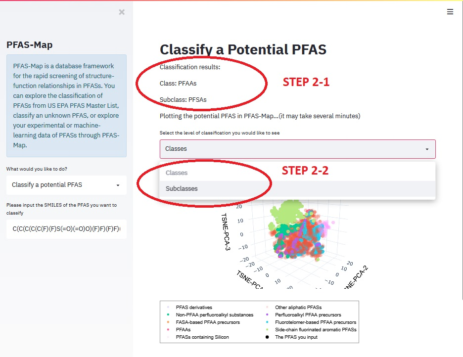


3. * Go to full-screen graph and explore as instructed in step 3 and 4 of "Exploring the classification of PFASs". 
   * The only difference will be the extra data point and its legend for the PFAS you input. 
   
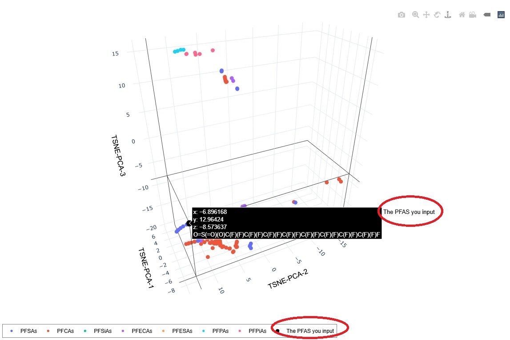


### Show your own PFAS dataset including classification and property
1. * Select the third function "explore your PFAS property data".
   * Select the .csv file you would like to put on PFAS-Map. Make sure you follow the instruction to modify the corresponding column names. There are some sample datasets for you to test under the "test_data" folder.
   
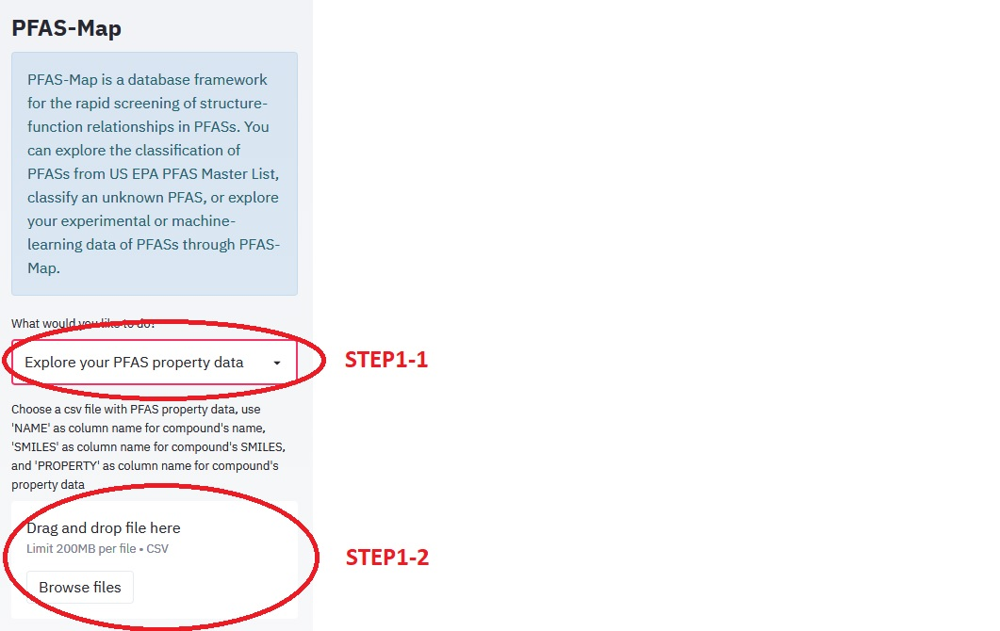


2. * Wait for several minutes (the time depends on the size of your dataset). 
   * After the graph shows up, go to the fullscreen mode as instructed.
   
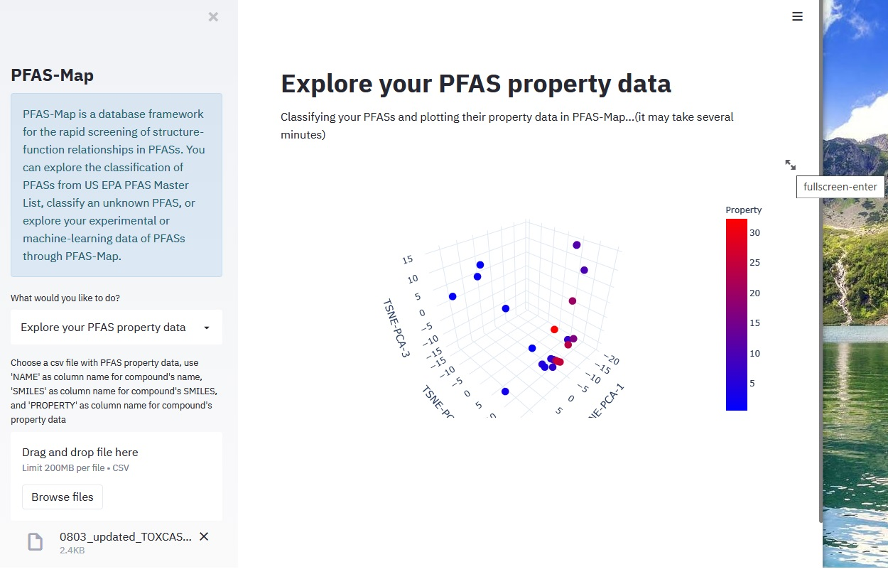


3. * Explore your PFAS dataset! The hover text shows the PC values, name, SMILES, property value, and classification results.

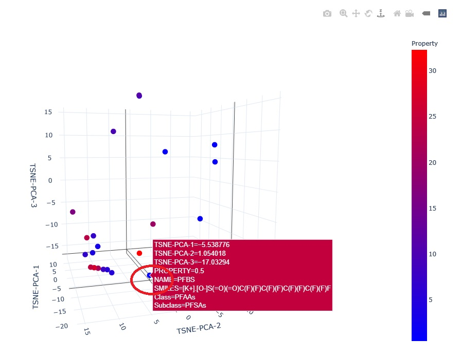


## Authors

* **An Su, Postdoctoral Associate, University at Buffalo** 
* **Krishna Rajan, Erich Bloch Chair & Empire Innovation Professor, University at Buffalo** 
